Прошло 2 месяца после первой (но конечно же не последней) конференции PiterJS conf. Для активистов сообщества это был своего рода праздник, к которому долго готовишься и столько же отходишь. В этой статье хочу подвести итоги, анонсировать публикацию докладов, понастальгировать и чуть-чуть похвастаться.

[**Фотоотчет**](https://vk.com/album-92250781_267125123 "https://vk.com/album-92250781_267125123")

# Зачем делать свою конференцию?

Конференцию организовали примерно 40 человек. Это волонтеры, партнеры, докладчики, активисты сообщества, MC (Master of Ceremony), DJ, фотограф и видеооператор.

Если взять грубую аппроксимацию.. то получится 4 человеко-дня (чд) на каждого организатора, так как некоторые были задействованы только на застройке и самой конференции = 1.5 чд. Другие тратили по 7–14 чд, например, некоторые докладчики и часть активистов. В итоге 4(чд)\*8(часов)\*40(оргов) = 1280 человека и бла бла бла…

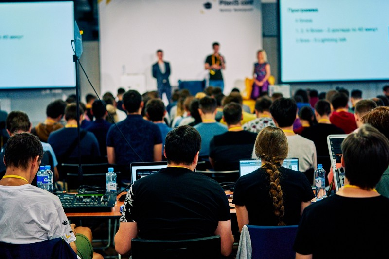

Но дело не в затраченном времени.. Кто-то выращивает клубнику, кто-то катается на досках, а кто-то занимается сообществом, делает доклады, собирает конференции для своего удовольствия.

Это очень увлекательные занятия, которые стремительными темпами приближают поезд выгорания от работы на бесплатной основе. Если повезет, и событие пройдет без сучка и задоринки, то можно будет потешить свое самолюбие от большого количества благодарностей и удовлетворить свои альтруистические желания “сделать мир лучше” на ближайшие пару месяцев.

Но какая-то неведомая сила заставляет людей сидеть вечерами над пруфами интересных концепций, коммитами в популярные репозитории, написанием статей, подготовкой докладов и пр. Поэтому если вернуться к вопросу “Зачем делать свою конференцию?”, лично я, на него общего ответа не знаю. У каждого это свои цели, пока не попробуешь — не поймешь :)

Но давайте к итогам)

# Как прошла конференция

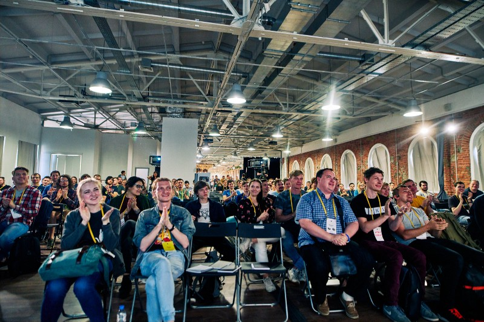

На конференции было около 550 человек и 50–100 смотрели онлайн. 150 человек оставили отзывы, на основе которых [NPS](https://ru.wikipedia.org/wiki/%D0%98%D0%BD%D0%B4%D0%B5%D0%BA%D1%81_%D0%BF%D0%BE%D1%82%D1%80%D0%B5%D0%B1%D0%B8%D1%82%D0%B5%D0%BB%D1%8C%D1%81%D0%BA%D0%BE%D0%B9_%D0%BB%D0%BE%D1%8F%D0%BB%D1%8C%D0%BD%D0%BE%D1%81%D1%82%D0%B8_NPS) получился равным 84, а это очень хороший показатель.

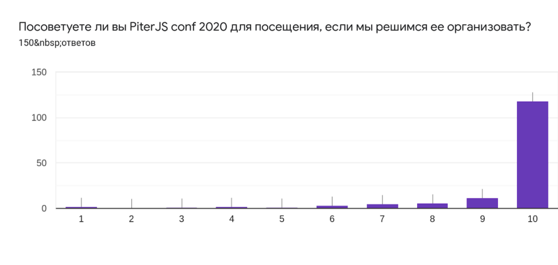

Были хорошие комментарии и конструктивная критика, как докладов, так и организации. За что огромное спасибо! Ведь, как известно:

> Понятие обратной связи, можно сказать, сформировало кибернетику как науку. (с) авторы статьи [“Обратная связь” на wiki](https://ru.wikipedia.org/wiki/%D0%9E%D0%B1%D1%80%D0%B0%D1%82%D0%BD%D0%B0%D1%8F_%D1%81%D0%B2%D1%8F%D0%B7%D1%8C_%28%D0%BA%D0%B8%D0%B1%D0%B5%D1%80%D0%BD%D0%B5%D1%82%D0%B8%D0%BA%D0%B0%29)

Что касается технических деталей, были мелкие огрехи заметные искушенному зрителю, но в целом мы довольны (уже провели 40 митапов как-никак).

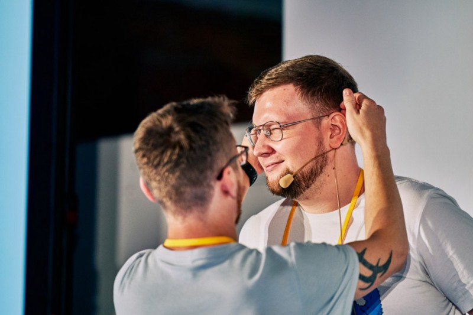
Миша чешет за ухом ember-евангелиста Алекса мотивируя к докладу (шутка, на самом деле Миша просто надевает петличку).

# **Доклады**

Ну и самое интересное! Рад анонсировать доклады! Полный список можно найти в [этом плейлисте](https://www.youtube.com/playlist?list=PLcXJ90eZ2bxhXhNINIvebZQkQO35eacOU). Но давайте рассмотрим каждый из них подробнее:

## Как запустить Telegram в VS Code

Спикер: [Александр Коротаев](https://twitter.com/mamu_eval)

[Слайды](https://fs.piterjs.org/events/conf2019/korotaev.pdf)

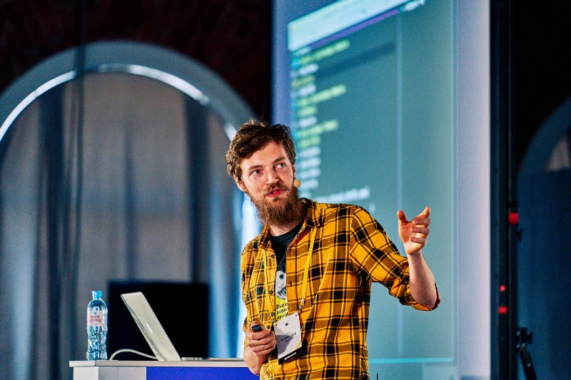

Саше не нравилось, что time tracker фиксировал много впустую потраченного времени и большая часть этого времени приходилась на приложение telegram. После того, как Саша написал консольный интерфейс телеграмма и стал открывать его в VS Code, time tracker перестал ругаться)

Если серьезно, то в докладе раскрываются детали реализации удобных консольных утилит. Какие есть инструменты для написания консольных UI, как сделать автодополнение, выделение цветами и как использовать практики фронтенда (например, не писать консольное приложение на angular).

## GraphQL — уменьшаем энтропию

Спикер: [Полина Гуртовая](https://github.com/HellSquirrel)

[Слайды](https://fs.piterjs.org/events/conf2019/gurtovaya.pdf)

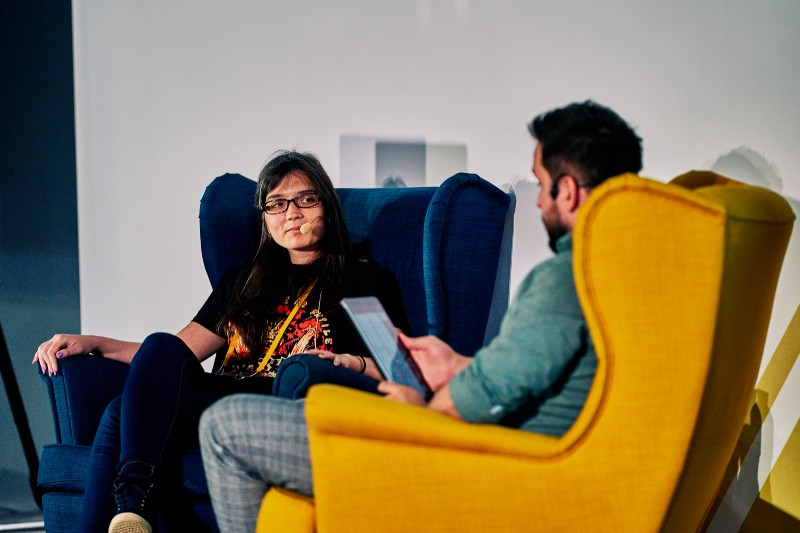

Доклад был основан на решении практической задачи. Представьте приложение, в котором большое количество интеграций со сторонними сервисами, и у каждого сервиса свои представления данных. В одном сервисе поле \`language\` находится на уровне описания товара, в другом это свойство пользователя, в третьем вообще не передается.

Эту проблему очень хорошо решает абстрагирование от сторонних API и выделение своих удобных структур (своего рода фасад). А сокрытием сложности и причесывания внешнего мира под наш займется подход с использование GraphQL.

## Поддержка старых браузеров в CSS-in-JS на AST-преобразованиях

Спикер: Яна Менемчиадиc

[Слайды](https://fs.piterjs.org/events/conf2019/yana.pdf)

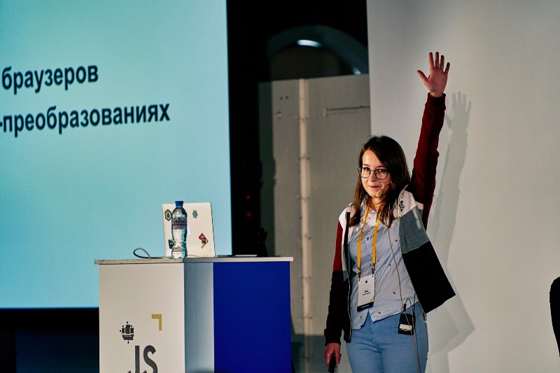

Этот доклад отлично подходит для просмотра с параллельным переключением на эксперименты с AST. Так как разбор является достаточно последовательным и доскональным.

Яна решала проблему отсутствия реализации CSS-переменных в IE через реализацию babel-плагина. Если представить, как должен выглядеть полный полифилл CSS-переменных, не сложно догадаться, что нам пришлось бы реализовывать достаточно тяжелую логику на клиенте, которая бы плохо отразилась на производительности. Но если ограничить этот полифилл рамками конкретной задачи и конкретного стека (например, только для CSS-in-JS, и без надобности изменять значения в динамике), то решение не скажется на производительности совсем.

Очень часто все, что можно решить через AST, решается через регулярные выражения.. Но давайте вспомним классиков и начнем переходить на светлую сторону.

> **Some people, when confronted with a problem, think  
> “I know, I’ll use regular expressions.” Now they have two problems.** [http://regex.info/blog/2006-09-15/247](http://regex.info/blog/2006-09-15/247)

## JSX в декларативные шаблоны с помощью AST

Спикер: [Александр Канунников](https://twitter.com/vaier)

[Слайды](https://fs.piterjs.org/events/conf2019/kanunnikov.pdf)

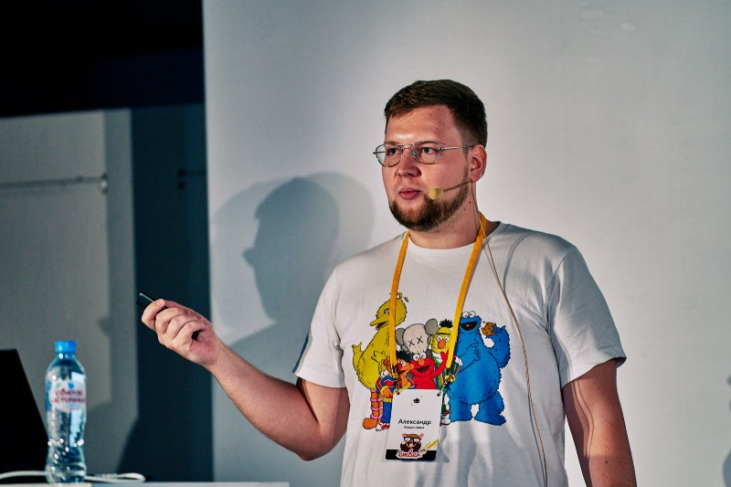

Еще один интересный доклад про AST, но решающий другие задачи. Боль проблемы, раскрывающейся в этом докладе, почувствуют люди, которые поддерживаются дизайн систему или набор компонентов для разных фреймворков. Чтобы на Angular, Vue, React описать компонент кнопки, вам нужно три честных реализации под каждый фреймворк, либо тащить несколько фреймворков под те или иные компоненты (кстати, если интересен второй вариант, то вот [эпизод самого часто выходящего подкаста](https://radiojs.ru/2018/05/%D0%B2%D1%8B%D0%BF%D1%83%D1%81%D0%BA-52-%D0%BC%D0%B8%D0%BA%D1%80%D0%BE%D1%81%D0%B5%D1%80%D0%B2%D0%B8%D1%81%D1%8B-%D0%BD%D0%B0-%D1%84%D1%80%D0%BE%D0%BD%D1%82%D0%B5%D0%BD%D0%B4%D0%B5/) и [статья с интересными ссылками](https://medium.com/@frontman/микросервисы-на-фронтенде-85ab4d37556e)).

Либо же можно преобразовать из наиболее популярного формата JSX во все остальные форматы.

> лирическое отступление: раньше PHP ругали за смешивание всего в одном коде, теперь JSX хвалят за это же.. Кто раскачивает эти технологические качели?

В таком случае нам не придется волноваться о консистентности и о том, что правки нужно вносить в несколько мест. Важно только реализовать конвертацию паттернов, которые мы используем.

## Optimize the size of your SPA, битва за байты

Спикер: [Дмитрий Пацура](https://twitter.com/ovrweb)

[Слайды](https://fs.piterjs.org/events/conf2019/patsura.pdf)

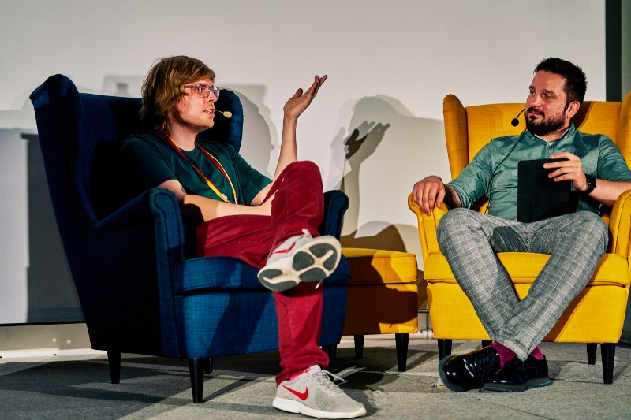

Дима провел исследование способов экономии размера передаваемых по сети javascript пакетов. Сравнил и разложил по полочкам способы компрессии, минификации, code splitting, tree shaking и упаковки пакетов.

Если Вы заботитесь о скорости загрузки своего приложения, то этот доклад определенно для Вас.

## Как построить Гексагон: прагматичная архитектура для клиентских приложений

Спикер: [Александр Мадьянкин](https://twitter.com/madyankin)

[Слайды](https://fs.piterjs.org/events/conf2019/madyankin.pdf)

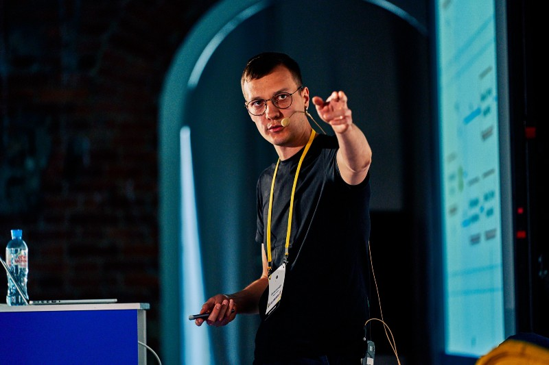

Завершили конференцию докладом про гексагональную архитектуру. Данный подход является хорошим средством для борьбы с технических долгом, позволяет грамотно “упаковывать” legacy участки нашего приложения и не давать размазываться этой логике по всему приложению. Есть два пути улучшения продукта: 1 — революционные, взять и все переписать. 2 — эволюционный, постепенно внедрять новые участки кода. Если первый подход очень сильно сказывается на стабильности приложения, то второй является более щадящим, но и более тяжелым, так как приходится больше нюансов держать в голове.

Александр пошел по эволюционному пути и решение выбрать гексагональную архитектуру пришло к нему через четыре года разработки SPA и React Native приложений. В основу выбора легли собственные пробы и ошибки, анализ и рефакторинг чужого кода.

# Блок блиц-докладов

Еще мы попробовали формат [блиц-докладов](https://ru.wikipedia.org/wiki/Блицдоклад) по 15 минут, в которых хотели дать легкий обзор определенных инструментов, библиотек, практик. То, что не нацелено на углубление в технические детали темы, а дает возможность понять что это вообще такое, как это готовить и куда бежать.

В следующем году мы, скорее всего, сделаем формат по 7 минут, так как за 15 можно вполне себе хорошо углубиться в детали и легким движением руки блиц-доклад превращается в полноценный доклад.

## Хроники Node.js: сообщество и корпорации

Спикер: [Николай Матвиенко](https://twitter.com/matvi3nko)

[Слайды](https://fs.piterjs.org/events/conf2019/matvienko.pdf)

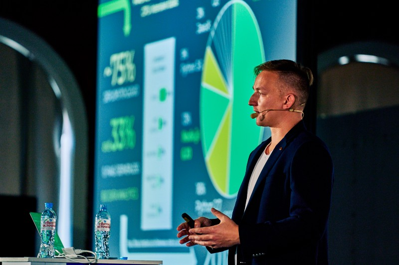

Перед тем, как использовать ту или иную библиотеку, платформу, мы редко смотрим на ее историю развития, какие сложности были на ее пути и куда это решение развивается.

Но мне кажется, это достаточно важная информация, так как она “оживляет” инструмент. И мы начинаем смотреть на него, как некий живой развивающийся и растущий механизм. С этим знанием мы можем ассоциативно предполагать, где это решение будет к месту, а где с ним могут быть сложности. В этом докладе Николай постарался “оживить” Node.js и показать историю javascript на сервере.

## **Как делать быстро прототипы приложений на современных технологиях**

Спикер: [Рустам Имайкин](https://twitter.com/irustm)

[Слайды](https://fs.piterjs.org/events/conf2019/imaykin.pdf)

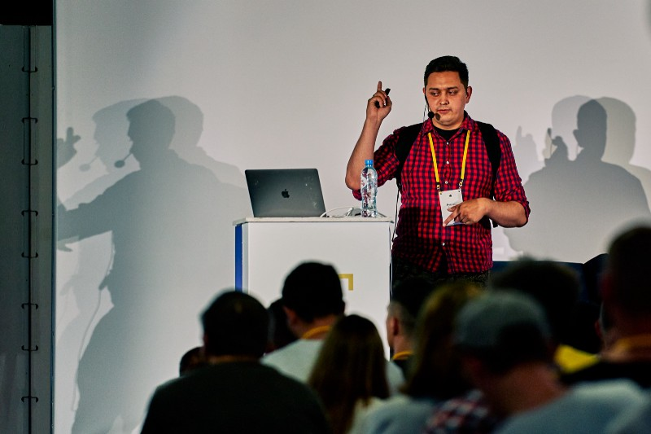

Мир меняется, меняются и инструменты прототипирования. Если раньше чтобы запустить свой интернет магазин, все брали готовые CMS решения, то сейчас на их смену приходят такие инструменты как firebase, bootstrap и прочее.

Рустам в докладе пробежался по небольшому списку подобных библиотек.

## Автоматизируй это. Гиперавтоматизированный пайплайн

Спикер: [Алексей Золотых](https://twitter.com/zolotyh)

[Слайды](https://zolotyh.github.io/piterjsconf2019/#/)

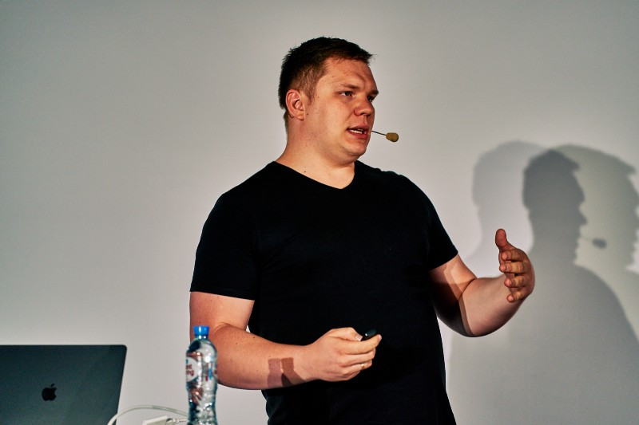

Кто помнит легендарную [цитату на баше про админа, автоматизировавшего процесс варки half-caf chai latte среднего размера](https://bash.im/quote/436725)? Можно сказать, что этот доклад был вдохновлен подобным подходом.

В докладе рассказаны некоторые хаки и вполне себе серьезные инструменты помогающие автоматизировать рутинные задачи CI/CD и не только.

## **State of Vue (2k19 Q3)**

Спикер: [Владимир Ульянов](https://twitter.com/lionskape)

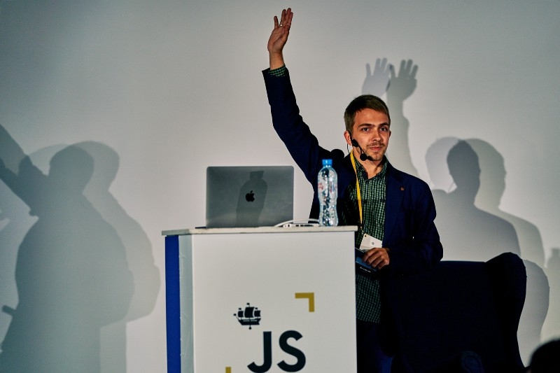

В докладе рассмотрены некоторые новшества, которые скоро появятся во vue.

Лично для меня оказалось самым интересным composition api. Часть функциональности, такая как методы `reactive`, `computed`, `watch`, похоже сильно вдохновлена mobx. Посмотрим как будет развиваться это API в дальнейшем.

## Holy War between Designers & Developers

Спикер: [Павел Юхнович](https://twitter.com/paul_yuhnovich)

[Слайды](https://fs.piterjs.org/events/conf2019/yuhnovich.pdf)

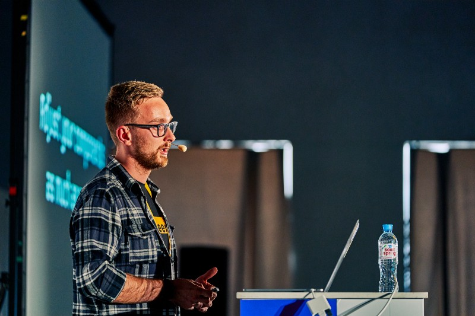

В докладе Павел рассказывает, как выстроить мост общения между разработчиками и дизайнерами. Основной инструмент, который он предлагает — создание дизайн-системы. Этот подход помогает здорово структурировать и привести в правильное русло процесс взаимодействия. Позволяет уменьшить эффект от постоянно меняющихся требований и позволит выдохнуть)

# **О будущем**

## PiterJS Conf 2020

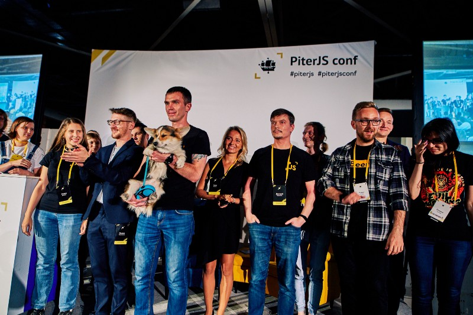

PiterJS Conf 2020 обязательно состоится. Предположительно, следующей весной мы сделаем анонс. А пока можете следить за нами в соц. сетях (их можно найти у нас на сайте  [piterjs.org](http://piterjs.org))

[**PiterJS**  
_Сообщество вокруг JavaScript, платформы node.js и все, что с ними связано c берегов Невы_www.youtube.com](https://www.youtube.com/channel/UCN9aK6ZG5PS1nnJZqscsmKw "https://www.youtube.com/channel/UCN9aK6ZG5PS1nnJZqscsmKw")

## Node.js Code+Learn

6 ноября в Москве, мы совместно с HolyJS на площадке [Tutu.ru](http://tutu.ru/) проведем Node.js Code+Learn. Это возможность сделать коммит в Node.js при менторстве core team members. Подробности в статье:

[**Announcement Node.js Code+Learn in Moscow**  
_2019 November 6 at the office of the company tutu.ru will be held Node.js Code+Learn._medium.com](https://medium.com/piterjs/announcement-node-js-code-learn-in-moscow-fd997241c77 "https://medium.com/piterjs/announcement-node-js-code-learn-in-moscow-fd997241c77")

## PiterJS #42

14 ноября пройдет ежемесячный митап. Подробности в анонсе:

[**Анонс PiterJS #42**  
_14 ноября в офисе компании JetBrains пройдёт ежемесячный митап PiterJS. Поговорим про логирование на JS, API на Node.js…_medium.com](https://medium.com/piterjs/%D0%B0%D0%BD%D0%BE%D0%BD%D1%81-piterjs-42-d760cebdb79c "https://medium.com/piterjs/%D0%B0%D0%BD%D0%BE%D0%BD%D1%81-piterjs-42-d760cebdb79c")

Спасибо всем, кто осилил эту статью! Ждем Вас на наших встречах!